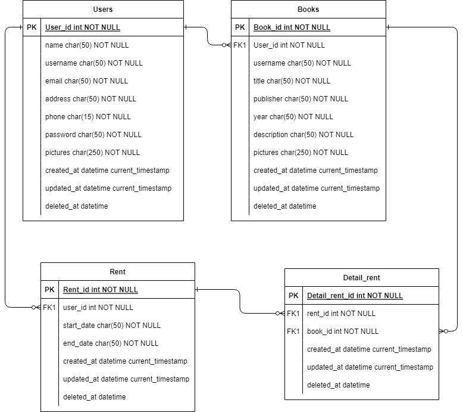

## 📑 About the Project
<p align="justify">Library App. Users can post books and users can borrow books from each other.<br>
  <br>
This RESTful API was developed by using Golang and written based on Clean Architecture principles. Built with Echo as web framework, GORM as ORM, MySQL as DBMS, etc.
</p>

## 🛠 Tools
**Backend:** <br>


**Deployment:** <br>


**Communication:**  


# 🔗 ERD


# 🔥 Open API

Simply [click here](https://app.swaggerhub.com/apis-docs/ADIYUDAPRANATA/LibraryApp/1.0.0#/) to see the details of endpoints we have agreed with our FE team.

<details>
  <summary>👶 User </summary>
  
| Method      | Endpoint            | Params      |q-Params            | JWT Token   | Function                                |
| ----------- | ------------------- | ----------- |--------------------| ----------- | --------------------------------------- |
| POST        | /register           | -           |-                   | NO          | Register a new Use                      |
| POST        | /login              | -           |-                   | NO          | Login to the system                     |
| GET         | /users              | -           |-                   | YES         | Show user profile                       |
| PUT         | /users              | -           |-                   | YES         | Update user profile                     |


  
</details>

<details>
  <summary>📑 Book</summary>
  
| Method      | Endpoint            | Params      | JWT Token   | Function                                |
| ----------- | ------------------- | ----------- | ----------- | --------------------------------------- |
| POST        | /books              | -           | YES         | Post a books                            |
| GET         | /books              | -           | NO          | Get All book                            |
| GET         | /books              | -           | YES         | Get MyBooks                             |
| PUT         | /books              | books_id    | YES         | Edit book                               |
| DELETE      | /books              | books_id    | YES         | Delete book                             |
| GET         | /books              | books_id    | NO          | Get books Detail                        |  

  </details>
     <details>
  <summary>📠 Rent Detail</summary>
  
| Method      | Endpoint            | Params      | JWT Token   | Function                                |
| ----------- | ------------------- | ----------- | ----------- | --------------------------------------- |
| POST        | /rentdetails        | -           | NO          | Make User Rent detail                   |
| GET         | /rentdetails        | rents_id    | NO          | Get User Rent detail                    |


  </details>
  <details>
   <summary>🔊 Rent</summary>
  
| Method      | Endpoint            | Params      | JWT Token   | Function                                |
| ----------- | ------------------- | ----------- | ----------- | --------------------------------------- |
| POST        | /rents              | -           | YES         | Make User Rent                          |
| GET         | /rents              | rents_id    | NO          | Get User Rent                           |
| GET         | /history            | -           | YES         | Get History Rent from User              |
| GET         | /bookrented         | -           | YES         | Get History Book Rented from User       |


  </details>
    
 

# 🛠️ How to Run Locally

- Clone it

```
$ git clone https://github.com/ALTA-PROJECT2-GROUP3/LibraryApp-BE.git
```

- Go to directory

```
$ cd LibraryApp-BE
```
- Run the project
```
$ go run .
```

- Voila! 🪄

### 🧰Backend

- [Github Repository for the Backend team](https://github.com/ALTA-PROJECT2-GROUP3/LibraryApp-BE)
- [Swagger OpenAPI](https://app.swaggerhub.com/apis-docs/ADIYUDAPRANATA/LibraryApp/1.0.0#/)


# 🤖 Author

-  Adi Yuda Pranata  <br>  [](https://github.com/Adiyuda123)
-  Iqbal Azwardi <br>  [](https://github.com/Iqballazuardi)
-  Wanta Zulfikri <br>  [](https://github.com/wanta-zulfikri)


<h5>
<p align="center">Created by Group 3 ©️ 2023</p>
</h5>
